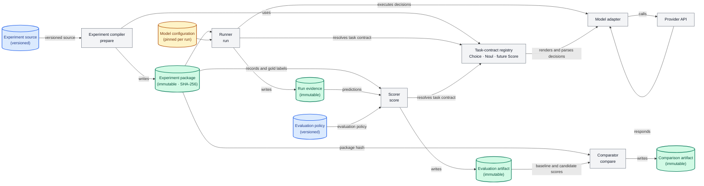

# Architecture

`jev-decision-bench` separates the decision problem, a model execution, and
the evaluation of that execution. This makes it possible to compare providers
fairly, preserve raw evidence, and re-evaluate a completed run without calling
a model again.



## Diagram conventions

Rectangles are code or external-service components. Cylinder-shaped data nodes are
artifacts read or written by those components. Blue data nodes are versioned
inputs, yellow data nodes are pinned for a particular run, and green data nodes
are immutable artifacts. The benchmark does not cryptographically sign
artifacts today: immutable artifacts are identified by their recorded SHA-256
hashes and never overwritten.

## Components

| Component | Responsibility | Does not own |
| --- | --- | --- |
| Experiment compiler | Reads a versioned experiment source, downloads pinned data, and writes a verified package | Model routes or evaluation results |
| Task contract | Semantics of Choice, Noul, or Score: schemas, native JEV shape, parsing, and validation | HTTP transport, dataset download, or aggregate metrics |
| Adapter | API transport: request serialization, authentication, response extraction, retries at the runner boundary | Whether an answer is a valid Choice or Noul decision |
| Runner | Resolves the package task type, executes each decision, and writes terminal prediction evidence | Scoring policy or metric aggregation |
| Scorer | Resolves the package task type, selects task-specific metrics, and applies an evaluation policy | Provider calls or changes to run evidence |
| Comparator | Joins scored compatible runs against an explicit baseline | Re-scoring or provider calls |

## Data artifacts

| Artifact | Lifecycle | Read by | Written by |
| --- | --- | --- | --- |
| Experiment source | Versioned in Git | Experiment compiler | Maintainers |
| Model configuration | Pinned per run by SHA-256 | Runner | Maintainers; runner snapshots the sanitized configuration |
| Evaluation policy | Versioned, editable input | Scorer | Maintainers |
| Experiment package | Immutable, SHA-256 identified | Runner, scorer, comparator | Experiment compiler |
| Run evidence | Immutable | Scorer | Runner |
| Evaluation artifact | Immutable | Comparator | Scorer |
| Comparison artifact | Immutable | Consumers | Comparator |

## Experiment package

`prepare` downloads only the source files pinned by the experiment spec,
verifies their hashes, and writes a package such as:

```text
artifacts/experiments/<experiment-id>/<version>/<package-hash>/
  experiment-manifest.json
  records.choice.jsonl or records.noul.jsonl
  rubric.json
  preflight.json
  source/
```

The package hash covers the compiled records, rubric, preflight fixture, and
manifest. The recommended `default-evaluation.json` remains in the versioned
experiment source, rather than the package, because evaluation policy may
change without changing the decision task.

`preflight.json` is an in-domain, unscored fixture. It proves that a configured
provider route can produce a structurally valid decision before the run sends
any test records.

## Task contracts

Task contracts are registered by task type in `src/jev_decision_bench/task_contracts.py`.
They interpret a decision's input and output meaning. The scorer resolves the
same task type from the package and dispatches to the corresponding aggregate
metric implementation.

| Contract | Current result shape | Key validation |
| --- | --- | --- |
| Choice | `choice` and `confidence` | Choice must be a frozen rubric key; confidence must be in `[0, 1]`. |
| Noul | `answer` and `probability_true` | Answer must agree with the recorded true probability at the execution threshold. |
| Score | Planned | Will define ordered levels and ordinal validation without altering Choice or Noul paths. |

For native JEV, a contract renders the appropriate question type. For an LLM,
it supplies the bounded JSON schema and instructions. Adapters then send those
rendered requests through their provider-specific APIs.

Adding a task type therefore means adding a contract and an experiment; it
does not require task-type branches throughout the runner or adapters.

## Run evidence

`run` snapshots the sanitized route configuration and links it to the exact
experiment-package hash. It appends one prediction and one audit event per
logical decision. Raw provider requests and responses are retained in
`events.jsonl`; normalized terminal outcomes are retained in
`predictions.jsonl`.

The runner rejects accidental duplicate runs with the same package, route
configuration, and adapter version. A stopped run can be resumed only when all
three still match.

## Evaluation and comparison

`score` reads saved predictions plus the package's task contract. By default
it uses the experiment's `default-evaluation.json`; `--evaluation` selects a
different compatible policy. It creates a separate artifact:

```text
artifacts/evaluations/<run-id>/<evaluation-id>--<evaluation-config-hash>/
  evaluation-config.json
  scores.json
```

This lets the same Noul probabilities be evaluated at another threshold, or
with another calibration-bin count, without rerunning the model. The policy is
snapshotted with each result, so old and new evaluations remain comparable and
auditable.

`compare` accepts only completed runs from the same package and evaluation
policy. It preserves their absolute metrics and adds deltas or ratios relative
to an explicitly selected baseline.

## Extension points

To add an experiment, create its versioned source directory with a pinned
dataset spec, rubric, preflight fixture, default evaluation policy, and a
compiler registration. To add a new provider, implement an adapter that
transports the generic rendered decision request. To add `Score`, implement
its contract and evaluator, then add a Score experiment; existing adapters,
runs, and evaluations stay unchanged.

## Next

Read the [Methodology](methodology.md) for the reproducibility rules, then use
[Running experiments](running-experiments.md) to prepare and execute a model run.
