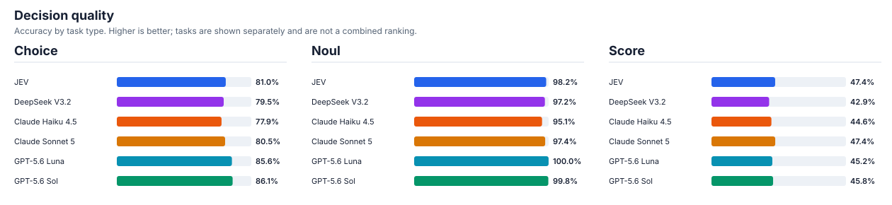
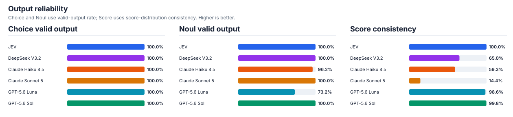
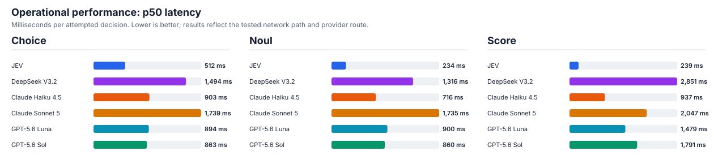
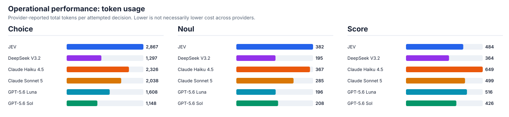

# Published results

This page compares the currently published model configurations across the
available decision tasks. It is a set of reproducible experiment snapshots,
not a single cross-task leaderboard: use each task's quality measures together
with its output reliability and operational performance.

Each comparison directory contains its human-readable report, aggregate
metrics, experiment and evaluation manifests, and sanitized run configurations.
Audit archives with normalized predictions and prepared records can be
published separately as release assets.

## Decision quality

Accuracy is shown per task and is not an overall cross-task ranking. TREC uses
nearest-tier accuracy from the reported continuous score; the other experiments
use their task's normal decision accuracy.

| Model | Intent routing accuracy | Policy & guardrail accuracy | Search relevance tier accuracy |
| --- | ---: | ---: | ---: |
| JEV | 81.0% | 98.2% | 47.4% |
| DeepSeek V3.2 | 79.5% | 97.2% | 42.9% |
| Claude Haiku 4.5 | 77.9% | 95.1% | 44.6% |
| Claude Sonnet 5 | 80.5% | 97.4% | 47.4% |
| GPT-5.6 Luna | 85.6% | 100.0% | 45.2% |
| GPT-5.6 Sol | 86.1% | 99.8% | 45.8% |

## Output reliability

Output reliability answers a different question from quality: did the model
return a usable answer that followed the task contract? It makes schema and
score-distribution failures visible rather than treating them as ordinary wrong
answers.

`json_schema` requests provider-enforced adherence to the full response schema;
`json_object` requests only a valid JSON object, which the benchmark then
validates against the task contract. The configured mode and effort are shown
for context, not as a causal explanation of the rates.

For intent routing and policy & guardrail decisions, this is the task
contract's valid-output rate. For search relevance, it is whether a usable
final score agrees with its probability distribution, plus the malformed-response rate.

| Model | Structured output | Effort | Intent routing valid | Policy & guardrail valid | Relevance consistency | Relevance malformed |
| --- | --- | --- | ---: | ---: | ---: | ---: |
| JEV | Native | — | 100.0% | 100.0% | 100.0% | 0.75% |
| DeepSeek V3.2 | `json_object` | — | 100.0% | 100.0% | 65.0% | 0.00% |
| Claude Haiku 4.5 | `json_schema` | — | 100.0% | 96.2% | 59.3% | 0.13% |
| Claude Sonnet 5 | `json_object` | Low | 100.0% | 100.0% | 14.4% | 0.06% |
| GPT-5.6 Luna | `json_schema` | — | 100.0% | 73.2% | 98.6% | 0.00% |
| GPT-5.6 Sol | `json_object` | Low | 100.0% | 100.0% | 99.8% | 0.00% |

## Operational performance

These measurements describe the observed cost of obtaining a decision in these
runs. They are useful for trade-offs within a provider route, but token totals
and latency are not universal cost measures across providers or networks.

Each performance cell is `p50 latency / reported total tokens per attempted
decision`. Latency is milliseconds. Token counts are provider-reported and not
cost-equivalent across providers.

| Model | Intent routing | Policy & guardrail | Search relevance |
| --- | ---: | ---: | ---: |
| JEV | 512 ms / 2,867 | 234 ms / 382 | 239 ms / 484 |
| DeepSeek V3.2 | 1,494 ms / 1,297 | 1,316 ms / 195 | 2,851 ms / 364 |
| Claude Haiku 4.5 | 903 ms / 2,326 | 716 ms / 367 | 937 ms / 649 |
| Claude Sonnet 5 | 1,739 ms / 2,038 | 1,735 ms / 285 | 2,047 ms / 499 |
| GPT-5.6 Luna | 894 ms / 1,608 | 900 ms / 196 | 1,479 ms / 516 |
| GPT-5.6 Sol | 863 ms / 1,148 | 860 ms / 208 | 1,791 ms / 426 |

## Published comparisons

Open a comparison report for task-specific quality, calibration, reliability,
and performance detail, along with its exact evidence and configuration
snapshots.

| Experiment | Task | Published | Package | Models | Report |
| --- | --- | --- | --- | --- | --- |
| [BANKING77 Choice](../experiments/banking77-choice/v0/README.md) | Intent routing | 2026-09-26 | `175e210593f7` | JEV, DeepSeek V3.2, Claude Haiku 4.5, Claude Sonnet 5, GPT-5.6 Luna, GPT-5.6 Sol | [Comparison](banking77-choice-v0--175e210593f7--20260926T070757Z-4975f004/README.md) |
| [HateCheck Noul](../experiments/hatecheck-noul/v0/README.md) | Moderation decisions | 2026-09-26 | `1409f2a86b78` | JEV, DeepSeek V3.2, Claude Haiku 4.5, Claude Sonnet 5, GPT-5.6 Luna, GPT-5.6 Sol | [Comparison](hatecheck-noul-v0--1409f2a86b78--20260926T070758Z-2e6677d0/README.md) |
| [TREC Score](../experiments/trec-score/v0/README.md) | Search relevance | 2026-09-26 | `91f38528cbd7` | JEV, DeepSeek V3.2, Claude Haiku 4.5, Claude Sonnet 5, GPT-5.6 Luna, GPT-5.6 Sol | [Comparison](trec-score-v0--91f38528cbd7--20260926T140924Z-110f1aa8/README.md) |
